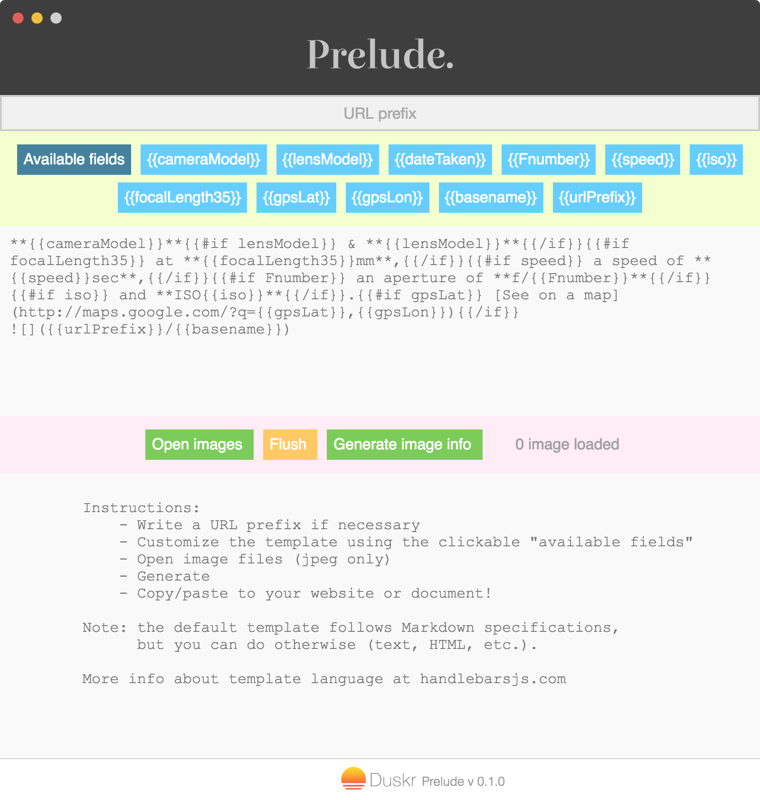

# Duskr Prelude

*Prelude* is a app developed with Electron for batch generating image descriptions. The first motivation behind *Prelude* is to quickly create blog articles with some EXIF data as description, and with a lot of pictures.

**[[Download the binaries for MacOSX]](https://github.com/jonathanlurie/Duskr-Prelude/releases/download/v0.1.0/Duskr-Prelude_OSX.zip)**  

Before going further, it looks like that:  


## Installation and build
You have the choice to run it simply:  
```shell
$ npm install
$ npm start
```

**[For MacOSX only]** Or you can build it as an independent application (Mac app file). For that you will need *Electron Packager* installed globally:

```shell
$ sudo npm install electron-packager -g
$ npm install
$ ./build.sh
```

The `build.sh` script will create a `Duskr-Prelude.app` in the folder `build` that you can move to your **Application** folder.

Note for Windows users: the procedure is really similar on Windows, just replace the `build.sh` by a `build.bat` and adapt the syntax for line breaks.

## The template

*Prelude* uses [Handlebars](http://handlebarsjs.com/) templates for generating data. Here are the data you can use:
- *{{cameraModel}}* the model of the camera, ie. **NIKON D800**
- *{{lensModel}}* the model of the lens, ie. **16.0-35.0 mm f/4.0**
- *{{dateTaken}}* the full datetime, ie. **Sun Aug 30 2015 16:28:45 GMT-0400 (EDT)**
- *{{Fnumber}}* the aperture F number, ie. **5.6**
- *{{speed}}* the speed in seconds or ratio, ie. **1/500**
- *{{iso}}* the ISO number, ie. **400**
- *{{focalLength35}}* the focal length equivalent in a fullframe format in mm, ie. **28**
- *{{gpsLat}}* the GPS latitude in decimal format, ie. **42.30957823**
- *{{gpsLon}}* the GPS longitude in decimal format, ie. **-82.30957823**
- *{{basename}}* the image file basename (without parent folders), ie. **myPicture.jpg**
- *{{urlPrefix}}* the prefix you wrote in *URL Prefix* text box, ie. **http://mysite.com/images**

The default Handlebars template is as follow:   
```md
**{{cameraModel}}**{{#if lensModel}} & **{{lensModel}}**{{/if}}{{#if focalLength35}} at **{{focalLength35}}mm**,{{/if}}{{#if speed}} a speed of **{{speed}}sec**,{{/if}}{{#if Fnumber}} an aperture of **f/{{Fnumber}}**{{/if}}{{#if iso}} and **ISO{{iso}}**{{/if}}.{{#if gpsLat}} [See on a map](http://maps.google.com/?q={{gpsLat}},{{gpsLon}}){{/if}}  


```

It may look a bit nasty but it is because for each field, there is a verification of its existance within the image EXIF. Without all the verifications, it would be way easier to read:  
```md
**{{cameraModel}}** & **{{lensModel}}** at **{{focalLength35}}mm**, a speed of **{{speed}}sec**, an aperture of **f/{{Fnumber}}** and **ISO{{iso}}**. [See on a map](http://maps.google.com/?q={{gpsLat}},{{gpsLon}})  
  


```

You may recognize bit of a *Markdown* syntax hidden in this *Handlebars* template, it's because I use Ghost as a blogging plateform but you could easily go with HTML or any other syntax.
Of course, you can customize this template and you can even use the blue rectangles with **{{...}}** patterns to add fields automatically.

## Example
If you open three photos, it will produce a *markdown* output like that:  
```md
**NIKON D800** & **16.0-35.0 mm f/4.0** at **28mm**, a speed of **1/500sec**, an aperture of **f/4** and **ISO200**.  


**NIKON D800** & **16.0-35.0 mm f/4.0** at **18mm**, a speed of **1/1000sec**, an aperture of **f/5** and **ISO200**.  


**NIKON D800** & **16.0-35.0 mm f/4.0** at **35mm**, a speed of **1/800sec**, an aperture of **f/5** and **ISO200**.  


```
(Note that my photos didn't have any GPS Exif, so the data was not generated)

Then, you can copy/paste this output into your favorite CMS.

And this is the output, really interpreted as *Markdown*:  

***

**NIKON D800** & **16.0-35.0 mm f/4.0** at **28mm**, a speed of **1/500sec**, an aperture of **f/4** and **ISO200**.  


**NIKON D800** & **16.0-35.0 mm f/4.0** at **18mm**, a speed of **1/1000sec**, an aperture of **f/5** and **ISO200**.  


**NIKON D800** & **16.0-35.0 mm f/4.0** at **35mm**, a speed of **1/800sec**, an aperture of **f/5** and **ISO200**.  


## TODO
- Put the templates in an external file (still internal to the app)
- Create several default templates and give the possibility to chose with a dropdown menu
- Add the possibility for the user to save his own templates, maybe using [Electron-json-storage](https://github.com/jviotti/electron-json-storage)

## License
MIT
